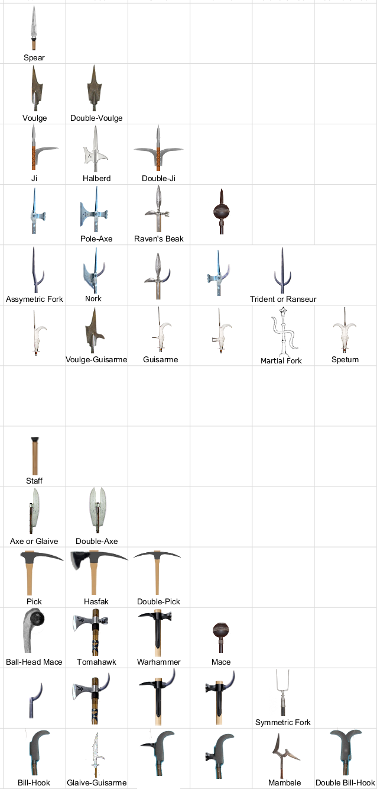

# Example Combat

These rules will be clearest if we begin with an example.  Alice and
Bob have decided to kill each other.

Alice is wearing neck-to-toe gambison, augmented with a plate cuirasse
on her torso and a half-closed plate helmet.  This combination leaves
her complete freedom of movement in her arms and legs, but does apply
a -3 penaly to spot checks.  She wields a halberd (long haft, blade
and sidespike, spear-point).

Bob is wearing head-to-toe chainmail, with a falchion (fore-bulging
3-foot blade) in his right hand and a rondel dagger (stilhetto, 1-foot
blade) in his left.

+-------------------------------------+-+----------------------------------------+
| Alice                               | | Bob                                    |
+=====+====+=+======+=====+===========+=+=====+====+=+======+=====+==============+
| Str | +2 | |BAB   |     |    DR     |v| Str | +2 | | BAB  |     |    DR        |
+-----+----+ |      +-----+---+---+---+s+-----+----+ |      +-----+---+---+------+
| Dex | +1 | | 3    | ACB | P | S | B | | Dex | +2 | |  2   | ACB | P | S | B    | 
+-----+----+ +------+-----+---+---+---+ +-----+----+ +------+-----+---+---+------+
| Con | +1 | | Head |  5  | 10| 20| 4 | | Con | 0  | |Head  |  2  | 2 | 20| 0    | 
+-----+----+ +------+-----+---+---+---+ +-----+----+ +------+-----+---+---+------+
| Int | -1 | |Torso |  8  | 12| 22| 8 | | Int | +1 | |Torso |  2  | 2 | 20| 0    | 
+-----+----+ +------+-----+---+---+---+ +-----+----+ +------+-----+---+---+------+
| Wis | -1 | |Arms  |  8  | 2 | 2 | 4 | | Wis | 0  | |Arms  |  2  | 2 | 20| 0    | 
+-----+----+ +------+-----+---+---+---+ +-----+----+ +------+-----+---+---+------+
| Cha | 0  | |Legs  |  8  | 2 | 2 | 4 | | Cha | -2 | |Legs  |  2  | 2 | 20| 0    |  
+-----+----+-+------+-----+---+---+---+ +-----+----+-+------+-----+---+---+------+
|*Attack*           |*atk*|*t*|*dmg*  | |*Attack*           |*atk*|*t*|*dmg*     |
+-------------------+-----+---+-------+ +-------------------+-----+---+----------+
|Halberd Side-spike |  +3 | P | 1d10+3| | Falchion Slash    | +6  | S | 1d8+2    |
+-------------------+-----+---+-------+ +-------------------+-----+---+----------+
|Halberd End-Spike  |  +4 | P | 1d6+2 | | Falchion Stab     | +1  | P | 1d8+2    |
+-------------------+-----+---+-------+ +-------------------+-----+---+----------+
| Halberd Blade     |  +4 | S | 1d12+3| | Dagger Slash      | +1  | S | 1d4+1    |
+-------------------+-----+---+-------+ +-------------------+-----+---+----------+
| Halberd Haft      |  +4 | B | 1d4+3 | | Dagger Stab       | +6  | P | 1d4+1    |
+-------------------+-----+---+-------+-+-------------------+-----+---+----------+

Alice moves to ten feet away and attacks.  Since Bob is wearing
chainmail, which is not very effective against piercing, she uses the
side-spike and doesn't worry about where she hits him.  Her attack
bonus is her base attack (3) plus her dexterity mod (1) totalling 4.
His AC is ten plus his dexterity modifier (2) totalling 12.  She rolls
a 12 totalling 16, a hit.

But Bob reacts by parrying with his falchion.  He rolls his own attack
(bab=2 dex=2 die=8 total=12) and adds half the result (6) to his AC.
Alice has now missed.

Bob advances cautiously to a distance of five feet.  He has the Two
Weapon Fighting feat, so he can attack with both weapons.  He begins
with the falchion.  Since it's not very effective against plate, he
deliberately slashes at her right arm.  His attack bonus is bab=2 plus
dex=2 plus using-a-blade-as-intended=2 = 6.  Her arm's AC is ten plus
dex (1) plus single-body-part (4) = 15.  He rolls a 12 for a total of
18: hit.

Alice cannot parry because halberds don't have the parry property.
But she can dodge, adding just her dex (1) to the roll (3) for a total
of 4 which is 2 points of AC.  Not enough.  Alice spends her one
addrenal surge to reroll the dodge (at no bonus, because its her only
surge) and this time rolls an 18, granting a AC bonus of 9 for a total
AC of 24, easily enough.

Bob attacks again, this time with the dagger.  It will barely do
damage if going through armor, so he stabs at her face.  His attack
mod has the 6 from before plus another 4 for using a dagger to get
around armor totalling 10.  Her AC has the 15 from before, plus
another 5 for a half-open helmet making 20.  He rolls a 14.

Alice has already reacted once this round and cannot dodge.  She is
hit.  Bob deals 1d4 + 1/2 strength mod damage.  He rolls a 3 and has a
str of +2, so this is 4 damage.  Alice has a constitution score of 12,
so her head is still functional.  But Bob has also learned that Alice
does not have the Combat Reflexes feat.

Alice cautiously backs up five feet and swings again.  Again, she
attacks at +4, his AC is 12 and he parries at +4.  She rolls a 15 for
a total of 19.  He rolls a 4 for a total of 16.  A hit.  Since she
wasn't aiming at a body part, she rolls randomly and gets left leg.  A
side-spike on a long haft deals 1d10 damage, and swinging a two-handed
weapon adds 3/2 strength mod.  Alice rolls a 5 and has a str of +2,
for 8 damage, reduced to 8 by the chainmail.  Bob has a constitution
score of 10 so his leg is still functional... barely.

Bob decides to get more aggressive and advances without caution.
Alice spends her reaction on an attack of opportunity which Bob
parries, successfully this time.  Bob then slashes at Alice's
already-damaged face with his falchion.  He attacks at +6 against her
face AC of 20.  He rolls a 15 and just barely hits.  He does 1d8+2=7
damage.  Combined with the 4 from earlier, she is in very bad shape.

Bob makes his second attack with the dagger.  Again, he attacks at +10
against her face AC of 20.  But this time he rolls a 17, exceeding her
AC by more than 5: a critical hit.  It's a piercing attack, so it
deals 2.5x damage.  He rolls a 3 (and has +1 from str), making 10
damage.  The total damage to Alice's head now exceeds her
constitution, but does not double it. She is unconscious and bleeding
out.

# General Rules

## Attacks

All attack rolls are bab+dex+size.  Melee weapons (and some ranged weapons) have a minimum strength needed to wield them.

An attacker chooses whether to simply attack the enemy or a specific body part (specific limb, torso or head) and, if a specific body part, whether to go around or through armor.  Each body part has an AC 4 higher than the enemy as a whole, and the armor's AC bonus is armor-specific.

Each body part has starting hit points equal to the creature's constitution score.  If the body part is reducted to zero or fewer hit points, it cannot be used.  If any of your body parts have negative hit points at the end of your turn, they lose at additional hit point.  If they reach negative constition score, they are destroyed permanently.

Melee attacks are either swinging or thrusting.  Swinging attacks get 3/2 strength when done in two hands, but may require adequate space.

One handed melee attacks add strength to damage for primary hand, 1/2 strength for off hand.

Distance provides an AC bonus (2 per increment) against ranged
attacks, but nothin against melee.  Note that this is a bonus to AC
and not a penalty to attack, this will matter in several cases.

## Movement

You can move up to your speed on your turn, and take a standard action (such as an attack) anywhere along your movement.

If you leave a threatened square, the enemy threatening it may use their reaction to make an attack of opportunity.  Moving Cautiously prevents this, but counts as having moved twice the distance.

Some actions (such as drawing a weapon from a sheath) cost five feet of movement.  Others (such as reloading a breach-action firearm) cost a Move Action, which is all your movement.

## Reactions

Reactions include attacks of opportunity, parries and dodges.

To parry, roll an attack with a parrying weapon and add half the result to AC.  Bonuses for using a weapon in a specific way (e.g. slashing with a fore-bulging weapon) don't apply here, but the double-polearm bonus of a trident or symmetric fork does, as does Weapon Focus or similar.  Only melee attacks to be parried (without a special feat).

Dodges are simple dex rolls, again adding half.  Only melee and pre-gunpowder attacks can be dodged.

You get one reaction per round, resetting at the beginning of your turn.  You can use a reaction during a reaction.

## Critical Hits

Exceeding AC by five makes a crit, by 10 a double-crit, etc.  Crits deal +25% damage for bludgeoning, +50% for slashing and +75% for piercing.  Double these percentages for a double-crit, etc.

There is no concept of critical failure, though some weapons do special things if an attack roll is low enough.  For these weapons, it is important to distinguish an ac bonus from an attack penalty.

## Non-lethal Damage

To make a non-lethal attack, you must know *how* to non-lethally attack the target creature, must attack with a bludgeoning weapon, and must achieve a critical hit.

To figure out how to non-lethally attack a creature, make a dc 15 heal check for that creature.  Once you succeed, you have the knowledge forever after, but if you fail, you cannot retry until your bonus has increased.  For creatures you have long been in the habit of fighting, you may simply assume you have made this check at some point in the past.

If you succed at making a non-lethal attack, the damage is not multiplied for the crit (though, if it's a double-crit, it's multiplied as a single crit, etc.).  The resulting damage is tracked separately from normal damage.  It stacks with normal damage for purposes of disabling body parts (zero hp) but not for permanently disabling them (negative con score hp).

However, if a body part takes five times con score in non-lethal damage, any additional non-lethal becomes normal.

Note that non-lethal damage is not safe.  If you hit your target and do not achive a crit, the damage will be lethal.  See the drug rules and Sleeper Holds in the Grappling section for safer options.

## Overpenetration

Attacks can overpenetrate.  Subtract the damage actually dealt (maxes at reducing a body part to negative constitution) as if it were armor (so hollow-point and armor-piercing rules apply), and then subtract the victim's armor again upon exit, even if the original wound went around armor.  If the remaining damage is positive, the weapon makes a stray attack on whatever's on the other side.

## Addrenal Surges

You have a number of addrenal surges equal to your con mod.  When you
fail a check and are in great danger as a result (usually a parry or
dodge, but potentially a reflex save or balance check) you may spend
an addrenal surge to reroll it.  Gain a bonus on the reroll equal to 4
times the number of addrenal surges remaining (so no bonus on the last
one).

You regain your surges with an hour of rest, or a proportional
fraction (rounding down) for a shorter period.

## The Ages

The ages are:

| Age | Examples |
|:-----|:------------------------------------------------------------------------------|
|Stone | Prehistory, pre-contact Americas|
|Bronze | Sumeria, Pyramid-building Egypt, Book of Judges, the Trojan War|
|Iron | Athenian League, Rome, Carolingian Empire, Zhou through Tang China|
|Spinning | Song China, Hundred Years' War, Venetian Empire, Hapsburg Holy Roman Empire|
|Gunpowder | European Wars of Religion, Ming China|
|Industrial | Napoleanic France, Georgian England, Early United States|
|Steam | US Civil War, World War One|
|Information | World War Two through present|
|Solar | Firefly, The Qeng Ho, Freefall|
|Star | Star Wars, Star Trek, Stargate|
|Galactic | The Culture, The Transcend (Fire Upon the Deep)|

Ages are a crude description.  Many settings will have some techs from an age and not others, especially for the most plot-relevant technologies.

Unless specified otherwise by the setting, martial weapons from three or more ages ago (e.g. Stone Age weapons in the Spinning Age) or from the future are Exotic.

# Weapons

## Blades

Blades are some of the simplest, yet also most versatile, weapons you can wield.  All blades can be used in both thrusting/piercing and swinging/slashing manners, though some are better at one than the other.  All blades can also be used to parry.

### Length

The most important variation in a blade is its length.  Conveniently, a sword's length (in feet) is equal to its weight (in pounds).

Name | Type | Handed | Special | Dmg | L=W | Strength Needed | Price
-|-|-|-|-|-|-|-
Dagger | Simple | One Handed | Gap Finding | 1d4 | 1 | 4 | 10
Shortsword | Simple | One Handed |  | 1d6 | 2 | 8 | 40
Arming Sword | Martial | One Handed |  | 1d8 | 3 | 12 | 90
Bastard Sword | Exotic or Martial | One or Two Handed | Flexible | 1d10 | 4 | 16 or 12 | 160
Longsword | Martial | Two Handed |  | 2d6 | 5 | 15 | 250
Greatsword | Exotic | Two Handed | Reach | 2d8 | 6 | 18 | 360
Blade properties by length for medium creatures

#### Character Sizes

The damage, reach and strength requirements of a blade are unaffected by the size of the wielder.  The handedness, type, name and special abilities do.  Specifically, the lengths they attach to are doubled (or halved) for every size category difference.

For example, a 2 foot blade will always weigh 2 pounds, deal 1d6 base damage and require 8 strength to wield in one's primary hand.  For a human, it would be a shortsword.  For a halfling, it would be a bastard sword, requiring an EWP feat to wield one-handed (but allowing two-handing with only 6 strength).  For an ogre, it would be a dagger, and would gain the Gap Finding ability.  A giant or brownie would be unable to wield it effectively.

Halfling daggers exist, deal 1d2 damage, and cannot be wielded effectively by big folk.  In theory, ogre greatswords exist as well (with double-reach) but they are not available in ordinary markets.

#### Special Abilities

A Dagger has the Gap Finding property, meaning that when a thrusting, around-armor attack is made with a dagger, the armor's Armor Class Bonus is reduced by 4 (to a minimum of zero).

A Bastard Sword has the Flexible property, meaning that it can either be a one-handed exotic weapon or a two-handed martial weapon.

A blade of six feet or longer has the Reach property, meaning that it threatens both adjacent squares *and* squares one further off.

### Profiles

The other way blades can vary is by profiles.  The profile produces attack modifiers for thrusting (piercing) and swinging (slashing):

| Profile | Thrusting | Swinging | Available From
|--|-|-|-|
| Fore-Bulging | -3 | +2 | Iron
| Waisted | -1 | +1 | Bronze
| Conventional | 0 | 0 | Stone
| Fully Tapered | +1 | -1 | Bronze
| Stiletto | +2 | -3 | Spinning

The five blade profiles, at similar lengths.

In some cultures, blade names change with profile.  For example, a fore-bulging dagger might be known as a kukri, and a stilletto arming sword as a rapier.  Other cultures just use the word “blade” and let adjectives do the work.  Yet other cultures split the difference with agglutantive word formation, but this is wandering off-subject a bit.

### Strength Needed

To wield a blade effectively requires a strength *score* which is a multiple of the blade's weight in pounds:

 | 
-|-
Dominant Hand | 4x
Weak Hand | 6x
Both Hands | 3x

You cannot wield a blade in more than two hands, even if you have them.  Note that this strength is not needed to *carry* the weapon.

### Exotic Materials

The vast majority of blades are made from steel, in any environment where steel is available.  Nevertheless, other materials are possible:

**Glass**: Halve armor DR, but the blade is destroyed if it is ever stopped by armor or parry, or if it takes any sonic or explosive damage.  Available in dagger length from the Stone Age, or any length from Spinning.

**Wood and Glass**: (a.k.a. macuahuitl) Every time the blade is stopped by armor or parry, it takes a stacking -1 penalty on future attack rolls, and it can no longer be used as a blade if it takes any sonic or explosive damage.  It can also be used as a short-hafted club, negating the preceding penalties.  Available from the Stone Age).

**Copper**: Triple price and -1 on all attacks.  Available from the Bronze Age.

**Bronze**: Dectuple price.  Counts as copper if that is beneficial.  Available from the Bronze Age

**Titanium**: Halve weight.  Decrease base damage die one step.  Available from the Information Age.

**Plasma**: Ignore armor and parries (except from other plasma blades).  Add +2d6 fire damage to all successful attacks.  Deal yourself 2d6 fire damage (random body part) on any total attack roll less than 10.  Available from the Star Age.

### Customization

Feel free to decide the curvature, edge-count, hilt-guard, distal taper and decoration of your blade.  These things have no mechanical effects.

## Hafted Weapons

A hafted weapon has a wooden pole and a (usually) metal head.  

The pole may be short (2ft: suitable for attacking enemies in adjacent squares), long (7ft:suitable for attacking enemies one square away) or very long (12ft: suitable for attacking enemies two squares away).  Unlike greatswords, a hafted weapon cannot be used against targets which are closer than it's range (unless you have a special ability to counter-act this).

The head of a hafted weapon may contain a terminal spike, and up to two features, though heads with a spike *and* two features only become available in the Spinning Age.  If the two features are the same, the weapon gives a +1 bonus on attack rolls with the feature, since it can be used forehand or backhand as the enemy's defense encourages.  The amount of damage done by a feature is affected by the length of the shaft:

Feature | Weight | Damage Type | Attack Type | Special | Short | Long | Very Long
--|-|-|-|-|-|-|-
Bare Haft | 0 | Bludgeoning | Either |  | 1d3 | 1d4 | 1d6
Spearhead | 1 | Piercing | Thrusting |  | 1d6 | 1d6 | 1d6
Blade | 2 | Slashing | Swinging |  | 1d10 | 1d12 | 2d8
Spike | 1 | Piercing | Swinging |  | 1d8 | 1d10 | 1d12
Blunt Face | 2 | Bludgeoning | Swinging |  | 1d6 | 2d4 | 2d6
Foreward Hook | 1 | Piercing | Thrusting | Parrying | 1d4 | 1d4 | 1d4
Backwards Hook | 1 | Piercing | Thrusting | Tripping | 1d4 | 1d4 | 1d4

Tripping: weapons with a backwards hook can be used to make trip attacks with a +4 bonus and no attack of opportunity.

The possible hafted weapon heads and some names they might go by.

There is tremendous cultural variation in the naming of hafted weapons, including which weapons get names at all, which different weapons are given the same name, and which weapons have multiple names based on exactly how the head attaches to the shaft, with no general term.

Note that while the glaive-guisarme can be equally properly refereed to as a guisarme-glaive, the glaive-glaive-glaive-guisarme-glaive is an inside joke among weapons vendors (who traditionally claim to expect one in stock next thursday) and not an actual weapon.

### Weight and Requisite Strength

While the haft of a hafted weapon has weight (1, 2 or 4 pounds depending on length), it is the weight of the head which determines the strength needed to wield it.  However, the shaft length does determine the multiplier, as it is the product of inertia and lever-length that determines the torque the wielder must apply.  In this case, the wielder's size affects the needed strength for two-handed grips, as the space between hands provides its own leverage.

Wielded in | Short | Long | Very Long
--|-|-|-
Primary Hand | 3 | 14 | 30
Off Hand | 6 | 28 | 60
Two Hands (medium) | 2 | 3 | 10
Two Hands (small) | 4 | 6 | 20
Two Hands (large) | 1 | 1.5 | 5

### Complexity

The Club, Staff, Shortspear, Longspear, Axe, and Mace (see examples) are Simple weapons.  Apart from these, hafted weapons with hooks (foreward or backward) are Exotic, and those without are Martial.

### Cost

The cost of a hafted weapon depends on the complexity of its head:

. | No Spike | Spike
-|-|-
0 Features | 3 | 10
1 Feature | 30 | 100
2 Features | 150 | 300

### Example Weapons

These are not the only available hafted weapons, but they are pre-statted for your convenience:

Name | Complexity | Spike | Feature 1 | Feature 2 | Haft | Cost | Head Weight | Total Weight | Strength Needed (1h) | Strength Needed 2h | Damage | Special
--|-|-|-|-|-|-|-|-|-|-|--|--
Club | Simple | No | None | None | Short | 3 | 0 | 1 | 0 | 0 | Bludgeoning 1d3     | 
Staff | Simple | No | None | None | Long | 3 | 0 | 2 | 0 | 0 | Bludgeoning 1d4     | 
Shortspear | Simple | Yes | None | None | Short | 10 | 1 | 2 | 3 | 2 | Piercing 1d6     | 
Longspear | Simple | Yes | None | None | Long | 10 | 1 | 3 | 14 | 3 | Piercing 1d6     | 
Axe | Simple | No | Blade | None | Short | 10 | 2 | 3 | 6 | 4 | Slashing 1d10     | 
Mace | Simple | No | Blunt | Blunt | Short | 150 | 4 | 5 | 12 | 8 | Bludgeoning 1d6     | +1 on attacks
Pike | Martial | Yes | None | None | Very long | 10 | 1 | 5 | 30 | 10 | Piercing 1d6     | 
Tomahawk | Martial | No | Blunt | Blade | Short | 150 | 4 | 5 | 12 | 8 | Bludgeoning 1d6 Slashing 1d10   | 
Ji | Martial | Yes | Spike | None | Long | 100 | 2 | 4 | 28 | 6 | Piercing 1d6 Piercing 1d10   | 
Ji-Pike | Martial | Yes | Spike | None | Very long | 100 | 2 | 6 | 60 | 20 | Piercing 1d6 Piercing 1d12   | 
Poleaxe | Martial | Yes | Blade | Blunt | Long | 300 | 5 | 7 | 70 | 15 | Piercing 1d6 Slashing 1d12 Bludgeoning 2d4 | 
Halberd | Martial | Yes | Blade | Spike | Long | 300 | 4 | 6 | 56 | 12 | Piercing 1d6 Piercing 1d12 Slashing 1d12 | 
Guisarme | Exotic | Yes | Spike | Backhook | Long | 300 | 3 | 5 | 42 | 9 | Piercing 1d6 Piercing 1d12   | Trip
Name-it-after-yourself | Exotic | No | Blade | Forehook | Long | 150 | 3 | 5 | 42 | 9 | Piercing 1d4 Slashing 1d12   | Parry

### Exotic Materials

The vast majority of hafted weapons are also made from steel (and wood), in any environment where steel is available.  Nevertheless, other materials are again possible.  

**Flint**: No hooks.  Spear-points cannot be combined with features.  -2 on piercing or slashing attacks, -1 on bludgeoning.  Available from the Stone Age.

**Copper**: Triple price and -1 on all attacks.  Available from the Bronze Age.

**Bronze**: Dectuple price.  Counts as copper if that is beneficial.  Available from the Bronze Age

**Titanium**: Halve head weight for piercing features only (others require the weight to be effective.  Available from the Information Age.

**Plasma**: Ignore armor and parries (except from plasma blades).  Add +2d6 fire damage to all successful attacks.  Deal yourself 2d6 fire damage (random body part) on any total attack roll less than 5.  No hooks or bludgeons.  Available from the Star Age.

**Carbon Fiber**: Halve the *pole* weight.  In case you care about that.  Available from the Information Age.

### Flails

Flails are like maces, except that the head is attached to the haft by a flexible chain, rope or cable.  The mechanical effects of this are:

* Complexity becomes Exotic
* Damage decreases by one die size
* Can make disarm attempts without provoking an attack of opportunity
* For a short-hafted flail, a total attack roll less than 5 means you strike yourself in a random body part

#### Nunchuks

Nunchuks are a variant of flail where the ball is a copy of the haft.  This has the following effects:

* Damage decreases by another die size
* Must use haft-length corresponding to creature size (medium=short, large=long, huge=very long)
* Regardless of size, a total attack roll less than 10 means you strike yourself in a random body part
* Cannot use special materials
* +2 on perform(weapon drill) checks

## Ranged Weapons

A ranged weapon contains both the weapon itself and the projectile it sends at the enemy.  Most ranged weapons have at least some flexibility in what projectiles they can send.

While melee weapons are mostly fixed by the late iron age, ranged weapons develop extensively.  Pay attention to your setting notes.

### Weapon Qualities

Weapon | Ammo | Damage | Range | Reload Time | Complexity | Availability | Hands | Strength Needed | Weight | Length | Cost | Special
-|-|-|-|-|-|-|-|-|-|-|-|-
Throw | Any with Range | ammo+strm | ammo×(str/10) | n/a | Simple | Stone | 1 | weight×2 | 0 | 0 | 0 | Arcing, Ready
Drop | Any with Range | ammo×min(height/20',2) | 20 | n/a | Simple | Stone | 1 | weight/6 | 0 | 0 | 0 | unlimited range, swift -10, head
Atlalt | Javelin | ammo+strm | 2×ammo×(str/10) | Free Action | Martial | Stone | 2/1 | 6 | 1 | 2 | 1 | 
Sling | Stone, Ball, Grenade or Bomb | ammo+strm | 3×ammo×(str/10) | Move Action | Martial | Stone | 2/1 | weight×3 | 0.01 | 0 | 1 | Risky, Arcing
Slingstaff | Stone, Ball, Grenade or Bomb | ammo+1.5×strm | 3×ammo×(str/10) | Move Action | Simple | Stone | 2 | weight×2 | 2 | 1 | 2 | 
Long Bow | Arrow | ammo+rating | 100+5×rating | Free Action | Martial | Stone | 2 | rating+10 | 3 | 0 | 10+rating^2/5 | Standing, Arcing
Short Bow | Arrow | ammo+rating | 100+5×rating | Free Action | Martial | Stone | 2 | rating+10 | 2 | 0 | 30+rating^2/10 |  | Arcing
Blow-Pipe | Dart | ammo | 30 | Move Action | Simple | Stone | 2/1 | 3 | 0.01 | 1 | 10 | Handless -2, Ready
Onager | 5 lb Stone or Ball  | 5×ammo | 100 | 4 minutes | Martial | Iron | n/a | 12(reload) | 1000 | 15 | 200 | Long, Aim During Reload, Strain, Arcing
Goatsfoot Crossbow | Bolt (light or heavy) | 2×ammo | 80 | 2 rounds | Simple | Iron | 2/1 | 12(reload) | 4 | 2 | 20 | Strain, Ready
Windlass Crossbow | Bolt (light or heavy) | 3×ammo | 100 | 5 rounds | Simple | Iron | 2/1 | 8(reload) | 5 | 2 | 30 | Strain, Ready
Trebuchet | 5-10 lb Stone, Ball or Bomb | 7×ammo | 120 | 2 minutes | Martial | Spinning | n/a | 12(reload) | 2000 | 20 | 400 | Long, Aim During Reload, Assembly Required, Arcing
Ballista | Oversize Bolt | 5×ammo | 120 | 2 minutes | Martial | Iron | str | 12;33 | 32 | 10 | 200 | Strain
Firearm | *See* | *Separate* | *Table* | | Simple | | | | | | | Ready
Grenade Launcher | Grenade | 2×ammo | 100 | Move Action | Martial | Information | 2 | 12 | 3 | 1 | 50 | Long
Underslung Grenade Launcher | Grenade | 2×ammo | 80 | Move Action | Martial | Information | n/a | 12 | 2 | N/A | 50 | Long. Attaches to Firearm
Dart Gun | Dart | 2×ammo | 80 | Free Action | Simple | Information | 1 | 3 | 2 | 2 | 20 | Ready
Laser | Coherent Light | rating×ammo | 500 | Free Action | Simple | Solar | 1 | 6 | rating + power source | Varies | 100 | Unlimited Range, Energy Cost: rating, Auto-aim, Ready
Blaster | Plasma Blast | rating×ammo | 300 | Free Action | Simple | Star | 1 | 6 | rating/2 + power source | 1 | 70 | Burst Mode, Spray Mode (100), Energy Cost: rating/2, Auto-aim, Ready

#### Ammo

What sorts of projectiles the weapon supports.  For “Any with Range”, see the “Base Range” column in the projectiles table.

#### Damage

Damage dealt.  Here, “ammo” is the base damage of the projectile and “strm” is the wielder's strength modifier.  A few weapons (bows and energy weapons) have “rating”, a number that describes how much weapon it is.  While any rating is possible, a given store will likely offer ratings of weapon that are useful to the local customer base.

#### Range

The range increment for the weapon, in feet.  Here, “ammo” is the base range of the projectile, and “str” is the wielder's strength score.  (“Rating” is the same value as the previous column)

Yes, it's annoying that this column uses strength score when the previous column used strength modifier, but it makes the formulas easier to apply.

#### Reload Time

What sort of action is needed to reload the weapon so it can fire again.  If more than a round, the reloader must spend the listed time taking standard actions of reloading.

(While it is common for weapon wielders to do their own reloading, this is not necessary, and sometimes poor tactics.)

#### Complexity

What proficiency is needed to wield the weapon.

#### Availability

In what age the weapon becomes available, though there is no guarantee that any given setting will have exactly the expected weapons.

#### Hands

How many hands you need to wield the weapon.  “2/1” means: two hands to reload, but only one to shoot.  “str” means: however many you like, if you're strong enough (see next column).  “n/a” means the weapon is too large to wield in hands.

#### Strength Needed

Strength score needed to wield the weapon.  If marked “(reload)” this strength is needed to reload, but not to shoot the weapon.  If two numbers are given with a semi-colon, these are reload and shoot respectively. 

#### Weight

In pounds.  Does not include ammunition.  For energy weapons, the weight of the power source is not included (see power sources, chapter ???).

#### Length

If the length of a weapon equals or exceeds 40% the width of the available space, the wielder suffers a -2 Close Quarters Penalty on attacks and loses the benefits of Ready.  The penalty can be negated by adopting a Shooting Stance (which also gives its usual bonus).

#### Cost

At least until the Economics suplement comes out

#### Special

Many weapons have special properties:

##### Aim During Reload

Weapons with this property (most siege weapons) must be aimed during the last action of reloading them.  This gives their targets (if mobile) a chance to be somewhere else.  You can lead the target if you choose, but they might realize you are and react accordingly.

##### Arcing

Weapons with this property can be fired *over* obstacles, provided the obstacle is adjacent to neither attacker nor target.  Doing so doubles the effective distance.  The attacker still needs a way of knowing the target's location.

##### Assembly Required

This weapon (trebuchet) cannot be transported intact using ordinary land transit.  It can be placed intact on a ship or transported on an oversized truck, but for an inland spinning-age siege, it must be assembled on site, a process that typically takes six hours.

##### Auto-aim

Weapons with this property (solar age or later) can assist your aim using stabalizing jets, granting a +4 bonus on attack rolls.

##### Burst Mode

This weapon (most long guns from the information age or later) can be fired in 3-round-burst mode.  Make a single attack roll: if you exceed the target's AC by 10, all three bullets hit; by 5, two bullets; at all, one bullet.  Bullets from a burst which miss follow the general rules for stray shots.  Only the first bullet qualifies for critical multipliers or other precision damage.

This stacks with the rapid shot feat and similar abilities.

##### Energy Cost

This weapon requires an outside energy source per shot fired.  The energy source is not included in the weight.

##### Handless -2

This weapon (a blowgun) can be shot with no hands at all, albeit at a -2 penalty.

##### Head

This weapon (dropping) always strikes humanoid enemies in the head, provided they are standing upright.

##### Long

This weapon allows you to make attacks at up to 10 range increments (albeit at a -20 penalty).  The normal limit is 5 increments.

##### Attaches to Rifle

This weapon (an underslung grenade launcher) cannot be used separately, but can be attached to any firearm with at least a one foot barrel.

##### Ready

For a character who is carrying a loaded Ready weapon, is not suffering a Close Quarters penalty, and has only taken a move action the preceeding turn, anyone becoming visible within 5 range incremens provokes an attack of opportunity.

##### Risky

This weapon (a sling) has a chance of striking you.  If your total attack roll is less than 5, you hit your own leg (the same side of your body as the sling).

##### Spray Mode

This weapon offers spray mode.  As a full-round action, you can fire either the number of bullets listed or until you need to make a non-free-action reload.  Make an attack roll against an area, and then treat all bullets you fire into the area as stray.

##### Standing

A medium creature using this weapon (a longbow) must stand to do it.  Larger creatures are not restricted.  Smaller cannot use it at all.

##### Strain

If this weapon is left loaded for more than an hour, the strain will render the weapon ineffective.

##### Swift -10

This weapon (dropping) can be “fired” as a swift action, but at a -10 on the attack roll.

##### Unlimited Range

There is no limit on how far this weapon can fire.  Nor is there any limit on the possible AC bonus for range.  Once you unleash it, someone or something (but not necessarily your target) is going to have a bad day.

#### Weapon-Specific Notes

##### Drop

As the name suggests, this is simply dropping an object.  As such, it can only be used to strike targets directly below you, or a bit to the side if there's wind or you're moving horizontally.

Objects do their base damage if dropped from 20 feet, or twice that if dropped from 40, but no more because of terminal velocity.  Unless they are drop-specialized (see flachettes in the projectiles section) which can do up to 4x base damage and have a range increment of 60 feet.

##### Bows

To produce high rating bows, especially shortbows, it is necessary to bend the ends the opposite direction (recurve) and sometimes to combine multiple materials (composite).  These are already factored into the price formulas.  Experienced warriors can often estimate the rating of a bow by eye using these clues.

### Firearms

Firearms vary enough to get their own table.  For any firearm, select a barrel length, width and style, an action, and as many special features as you like.  To a first approximation, length determines range and number of damage dice, size determines kind of dice, action determines rate of fire, and features determine cool extra things a gun can do.

Firearm weights do not include the weight of ammunition or (for gatling guns) a power source.

The barrel length must be at least 8 times the barrel width.

All firearms have the Ready property.

%%firearms%%

#### Strength Needed

This is the strength needed to maintain aim despite recoil.  It is not the strength needed to carry the weapon (see carrying rules), nor is it the strength needed to reload the weapon.  To reload, the round or magazine must be a light load (i.e.2lbs per point of strength score), but a team may reload a weapon together and add their strength scores.

The strength listed is for a two handed grip.  A strength 3/2 this is needed for primary hand, or twice for off-hand.

#### Magsize

The size of the magazine when using an action that uses magazines.  Irrelevant otherwise.

#### Ammo

In addition to being the right type, ammo must be the same size as the barrel width.

#### Max Attack

There is a maximum total attack possible with any given firearm.  If your total attack roll exceeds this, lower it to match.  Remember that range grants an AC bonus, not an attack penalty.  Note that for many characters this will have no effect.

#### Rain-Sensitive

Slowmatch based actions are unreliable (50% failure chance) in light rain, and completely non-functional in a downpour.

#### Strain

A slowmatch cannot be left burning (and thus ready to fire) for more than one minute.  Such a firearm can be carried loaded escept for this final step, which still requires a standard action (included in the loading time) and two  hands.

#### Powder Burn

A creature who uses a revolver that is of the largest supported size, wielding it in their arms, suffers 2d6 fire damage to their head each time they fire.  Smaller revolvers or full-size revolvers on gun stands deal this damage to where the users' head would be -- usually empty air.

#### Intimidation

The wielder of a pump-action firearm may sacrifice one bullet for a +2 bonus on intimidation against creatures who know what firearms are.

The wielder of a firearm with a decorative pump action may gain the bonus by pretending to sacrifice a bullet, but the bonus becomes a penalty if the target has ranks in knowledge(firearms) or craft(firearm).

#### Belt-Fed

Note that if the gun is in a vehicle and the enire vehicle moves, this is not a problem.  However, forced movement (from, e.g. a bull rush) does require re-readying.

#### Multi-barrel Blast

Fire all loaded barrels.  Use a single attack roll, but resolve armor separately for all bullets.  Strength needed increases by 2 for each barrel after the first.

#### Bayonette

A firearm with a bayonette may be used as a polearm with a final spike and a blade, but only a 2lb head.  A 1-4 ft barrel becomes a short-hafted polearm, an 8 ft barrel long-hafted, and a 16 foot barrel very-long-hafted.  For the size and strength needed to wield such a weapon, see the Hafted Weapons section.  No action is needed to switch the weapon from firearm to melee modes.

#### Gun Mounts

If a gun is too big or strong to fire from one's hands, it can still be used from a gun mount.  Mounts either add to or replace your strength, and often come with special restrictions:

Mount | Str | Length Enabled | Time to Set Up | Weight | Special
-|-|-|-|-|-
Bipod | +4 | x2 | Move Action | 1 |
Tripod        | +8 | x4 | 1 round | 2 |
Heavy Tripod  | 30 | 8 | 1 minute | 50 |
Bolted Tripod | 60 | 8  | 10 minutes | 10 | Floor must have bolt holes
Turret        | substrate | unlimited | 8 hours | 100 | Must attach to a secure substrate
Polearm | +2 | x2 | 1 round | 3 or more | Must have short haft and side spike, blade or forward hook
Ground | +2 | x2 | free | 0 | Must be prone

#### Example Firearms

%%examplefirearms%%

### Projectile Qualities

%%ammo%%

ᵃ Throwing Axes, Javelins and Broadhead Arrows listed here are iron-tipped.  Flint-tipped (-2 on attack rolls) versions are available from the stone age, and copper (-1 on attack rolls, 3x price) and bronze (10x price) versions are available in the Stone and Bronze ages respectively.

For projectiles fired from firearms, an equal weight of propelent and accoutrema is required, so the "carrying weight" of the ammunition is twice the weight of the projectile itself (shown here).

Recall that damage should be interpreted in the context of the weapons table.

Also note that the “damage” for grenades is the damage they deal by striking the enemy, which is little more than insult added to the injury of the explosion.

Special Abilities:

#### Melee

This ammunition can be used as a specific melee weapon, albeit at a small penalty to attacks.  If the melee is marked "rev", this also applies in reverse, and a melee weapon of this description can be used as ammunition at the same penalty.

#### Spread

Cannister behaves differently depending on the range to the target as a multiple of the *barrel length*:

Multiple | Effect on Medium Targets
-|-
0-30x | Normal Effect
30-60x | Hits are normal, misses by less than 5 deal half-damage
60-120x | Area-effect in a 5 ft wide line, lesser damage
120-240x | Area-effect in a 15 ft wide line, 1/3 of lesser damage
>240x | Deals no damage

For each size category larger the target is, double all distances except for the no damage threshold.  Similarly for smaller creatures, halve them, adding rows as needed, if the creatures' positions are being tracked with sub-square resolution.

Note that the double-armor-effect property cannister also has is not dependant on range.

#### Burn

In addition to main damage, this projectile deals this much fire damage.

Note that while base damage may be multiplied (by the weapon's rating for a blaster), burn damage is not.

#### Double armor effect

When reducing damage for armor, double the armor's effectiveness.  Also double the damage expended when calculating blowthrough.

#### Drop Specialized

When this projectile is dropped, it has a maximum damage of 5 times base (from a height of 100 feet) and a range increment of 50 feet.

#### Drug (Precision)

This projectile can be used to deliver a drug or poison.  If the projectile does damage, it also delivers the drug.

A simple poison dart deals a rough dosage, whereas a syringe deals a precise one.  See the drug rules.

#### Binding (Size)

When a bolas strikes a creature of indicated size or smaller, the creature must make a reflex save or grapple check (its choice) against twice the pre-dr damage.  If it fails the check, it is prone and wrapped in ropes.

#### Explodes

After impacting, this projectile explodes for the damage shown.  Note that this is not part of the ammo's own damage, and is not multiplied.

If the base damage gets past armor and does not overpenetrate, the explosion occurs *inside* the target, for triple damage.

#### Attatches

If this projectile successfully does piercing damage it sticks to its target.  It can then detonate *in contact* with said target for double damage.

Note: while the boring and descriptive name of this projectile is "spiked bomb", its original name was "flying incediary club for subjugating demons".

# Armor

Armor comes in four varieties: fabric (including gambeson, leather and glued hides), chain, scale (including lamelar and brigandine) and plate.  It covers six body parts: four limbs, torso and head (adjust for non-humanoids as needed).  You can mix and match (and layer) as you choose.

## Armor Properties

. | Fabric | Chain | Scale | Plate
:-|-:|-:|-:|-:
DR against Piercing | 2 | 2 | 10 | 10
DR against Slashing | 2 | 20 | 20 | 20
DR against Bludgeoning | 4 | 0 | 2 | 4
AC Bonus against “strike around” | 8 | 2 | 4 | 8
Weight (limb or helmet) | 1 | 4 | 8 | 6
Weight (torso) | 2 | 8 | 16 | 12
Weight (full suit) | 7 | 28 | 56 | 42
Armor Check Penalty  | 0 | -1 | -2 | -3
Cost | 100 | 200 | 300 | 1000
Available from | Stone | Iron | Bronze | Bronze/Spinning

Plate armor for head and torso is available from the Bronze Age, but for the limbs only becomes available in the Spinning Age.

## Sizing

These rules are for medium creatures.  Multiple or divide weight and cost by 4 for every size category away a creature is.

## Spot and Listen Penalties

Head armor gives a penalty to spot/listen checks equal to its Armor Class Bonus minus 2 (minimum 0).  You may construct head armor with a lower ACB if you wish. 

Three styles of steel plate helmets, with their associated AC bonuses and perception penalties.  They are sometimes refered to as "open face", "half-closed" and "full-pot".  In between levels also exist.

## Weight

The most armor you can wear is 3 lbs per point of strength score.  Each missing point of strength inflicts an additional -1 acp to all body parts.  This is *separate* from limits on how much ordinary gear you can carry.  (Some campaigns won't want to track that at all, but those that do should use 2lbs per strength.  A character who wears the maximum available armor and takes it off and carries that same armor *should* take overburdening penalties.)

All weights are computed for earth gravity.  In a low-gravity environment, you can wear more armor.

## Armor Check Penalty

Take this penalty to all physical actions involving the body part in question.  If multiple body parts are used, take the highest ACP.

Every point of penalty to leg-based motions (whether ACP or weight) reduces base speed by 5 ft/rnd, to a minimum of 5.

If acp ever reaches -20, the body part in question is immobilized.

Swimming takes ACP from arms and legs, and suffers a stacking -1 penalty for every three pounds of armor worm (rounded down).

## Stacking armor

You may wear multiple layers of armor.  Add the DRs and Weights.  Add the ACPs and add one for every layer after the first.  (Extra thick armor can be modeled as layering identical armors.)

Take the highest Armor Class Bonus *unless* you are stacking fabric and non-fabric armors.  In that case, take the highest non-fabric bonus, but attacks around armor still take the fabric's DR.  

## Other damage types

For heat or cold, armor protects as against piercing for the first round, but does not protect in subsequent rounds (unless made of Nomex, see Exotic Materials).

For electricity, metal armor protects completely and non-metal armor protects as against bludgeoning.

Armor does not protect against sonic damage.

Impacts with things larger than oneself (including the ground and explosive shockwaves) are bludgeoning but armor counts for half against them.

## Exotic Materials

**Bronze** (chain, scale or plate): x10 cost (Availability: Bronze Age)

**Kevlar** (fabric only): non-stacking +10 DR against projectiles (Availability: Information Age)

**Titanium** (chain, scale or plate): 3/4 weight, x2 cost (Availability: Information Age)

**Silicon Carbide** (scale only): 3/8 weight, x5 cost (Availability: Information Age)

**Aluminum Oxide** (plate only): No spot penalty in helmet (Availability: Solar Age)

**Nomex** (fabric only): Adds 5 rounds (stacking) to the time that armor protects against heat or cold

**Carbon Nanoweave** (fabric only): DR against piercing and slashing becomes 8 (Availability: Solar Age)

**Mithril** (chain, scale or plate): ½ weight, ACP-1 (Availability: high-magic settings)

**Monstrous Hide** (fabric or scale by creature): 3/4 DR of monster, except bludgeoning for scale armor which maxes at 2.  Double weight.  (A creature provides enough hide for torso armor or two non-torso pieces, or a full suit one size category smaller)

## Special Features

**Decoration**: Most armor is decorated.  This has no effect on its stats, though particularly frightening decorations may grant a small circumstance bonus to intimidation, and wearing the emblems of an organization that treats prisoners humanely may make it easier to convince enemies to surrender.

**Camouflage**: Grants +2 to Hide checks, rising to +4 in a chosen environment.  Cost +50.  Limits available decoration to small patches.  Available from Information Age.

**Shiny**: Decreases the effect of laser weapons by 90% before normal DR.  Cannot be combined with camouflage or decoration.  Available from Information Age.

**Air-sealed**: Allows the wearer to go up to 8 hours without breathing outside air.  Protects against poison, disease, nanotech and hard vacuum.  Requires all body parts to be covered in fabric or plate.  Cost +5000, Weight +10.  Available from Solar Age.

**Inertics**: Armor grants full protection against impacts with objects larger than oneself.  Also negates all damage from high gravity environments.  Each round inertics are active consumes 1MJ.  Cost +1000, Weight +1, not counting power source.  Available from Star Age.

## Armor Builder

%%armorbuilder%%

## Example Armors

These are some armor patterns from various eras.  All are mirror-symmetrical for simplicity of presentation, but feel free to armor one arm much more heavily than the other if you like.

%%examplearmor%%

# Shields

Shields come in varing sizes and materials (also shapes, but this has no mechanical effect).

| Diameter | Base Weight (hide) | Parry at | ACB: Shield Arm | ACB: Torso | ACB: Other |
| 1 | 1 | +4 | 1 | 0 | 0 |
| 2 | 2 | +2 | 3 | 1 | 0 |
| 3 | 4 | 0 | 5 | 3 | 1 |
| 4 | 7 | -2 | 7 | 4 | 1 |
| 5 | 11 | -4 | 9 | 6 | 2 |

| Material | Weight Multiplier | DR | Available from |
| Hide | 1 | 4 | Stone |
| Wood | 2 |  10 | Stone |
| Steel | 4 | 20 | Iron |
| Mithril | 2 | 20 | Iron |
| Lucite | 1 | 10 | Information |

## Active Use

A shield can be used to parry as if it were a weapon with the parry ability.  Take a bonus or penalty to the parry roll based on the size of the shield.  You must have a strength score at least twice the shield's weight to parry with it in your off hand (or equal for primary hand, or two thirds for both hands).

If you fail the parry so badly as to be critted, and the damage before the crit multiplier exceeds the damage reduction of the shield, the shield is destroyed.  (Normal active parry means brushing sideways such that the shield is not damaged, but if you fail badly enough...)

## Passive Use

Simply holding a shield also provides defense.  If the enemy is trying to strike around your armor, the shield adds ACB, and if through, adds DR, both as shown on the table.  DR from shields is the same regardless of damage type.  The shield only adds DR to body parts for which it provides at least one point of ACB.

## Hunkering

A character holding a shield may hunker behind it.  This causes all body parts to receive the same ACB as the torso (except the shield arm, which continues to receive higher) but means the character cannot attack and takes a -6 penalty on spot checks.  Starting and stopping hunkering are move actions.

(Note that you technically can hunker behind a 1 foot shield, but receive no benefit from doing so, and look very silly.)

## Non-Medium Characters

These rules are written for medium size characters (e.g. humans).  For other sizes, multiply or divide the diameter by the appropriate power of two for purposes of size-dependant traits other than weight.

# Feats

**Combat Reflexes:** Gain reactions per round equal to your dex mod (if positive).  If your dex mode changes during a round, resolve this as benefits you.

**Power Attack:** You may voluntarily take a penalty on attacks up to your BAB to gain a matching bonus on damage, or twice that as a bonus for a *swinging* two-handed weapon.

**Dodge:** For you, there is a skill Dodge(dex) which is always a class skill.  Use it instead of a raw dex roll on dodge checks.  Furthermore, Dodge grants a synergy bonus to parry rolls.

**Half-Swording:** You may wield any blade longer than a dagger in both hands and it gains the gap-finding property.  If the weapon had reach, it no longer does.

**Murder-Stroke:** You may wield any blade longer than a shortsword as a two-handed bludgeoning swinging weapon that deals 1d6 damage.

**Machine Gunner:** You may use any firearm with spray mode in two other ways: as if it were burst mode, or as if it were a cannister round with a spread-range of 100ft (lesser damage equal to original damage, greater equal to original times half rounds fired),

**Fury:** You may spend an addrenal surge to reroll a missed melee attack

**Rage:** *(Prereq: Fury)* You may spend an addrenal surge to gain +4 str, +2 to attacks and +2 temporary hit points in all body parts for the next minute.

**Extra Surge:** Gain one extra addrenal surge.  You may take this feat multiple times, to a maximum of your once more than your con bonus.